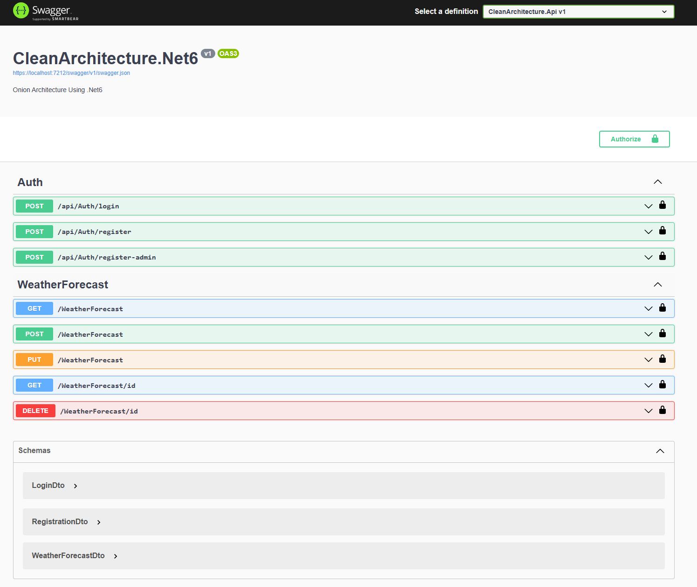

# CleanArchitecture.Net6

A sample implementation of the Clean Architecture pattern using .NET 6. This repository demonstrates how to structure a .NET application following best practices, ensuring maintainability, scalability, and testability.

---

## Features

- **Role-based Authentication and Authorization**: Provides secure access based on user roles.
- **JWT Authentication**: Ensures secure communication between the client and server.
- **Centralized Error Handler**: Simplifies error handling across the application.
- **Serilog Integration**: Comprehensive logging support for monitoring and troubleshooting.
- **Entity Framework Code-First Approach**: Simplified database management and schema generation.
- **Customized AutoMapper**: Streamlines object mapping between layers.

### Functional Features

- **Authentication**:
  - Register as a user.
  - Register as an admin.
  - Login.
- **Weather Forecast Management** (Admin-only):
  - Create, Update, Delete, View Weather Forecast entries.
- **View Weather Forecast**:
  - Accessible to any logged-in user.

---

## Technologies Used

- .NET 6
- ASP.NET Core Web API
- Entity Framework Core
- AutoMapper
- Serilog
- JWT Authentication

---

## Prerequisites

- [Visual Studio 2022](https://visualstudio.microsoft.com/) or [Visual Studio Code](https://code.visualstudio.com/)
- .NET 6 SDK
- SQL Server (or any configured database)

---

## Getting Started

Follow these steps to set up and run the project locally:

### 1. Clone the Repository
```bash
git clone https://github.com/biswajitpanday/CleanArchitecture.Net6.git
cd CleanArchitecture.Net6
```

### 2. Build the Project
Restore NuGet packages and build the solution:
```bash
dotnet build
```

### 3. Apply Migrations
Ensure your database connection string is configured in the `appsettings.json` file. Then apply migrations:
```bash
dotnet ef database update
```

### 4. Run the Application
Run the application using the following command:
```bash
dotnet run --project .\src\Presentation\CleanArchitecture.Api\CleanArchitecture.Api.csproj
```

---

## Project Structure

The repository follows a structured design for better maintainability and scalability:

```
├── src
│   ├── CleanArchitecture.Api       # API Layer (Presentation)
│   │   ├── Controllers             # API endpoints
│   │   ├── Middleware              # Centralized error handling middleware
│   │   ├── appsettings.json        # Configuration files
│   │   ├── Program.cs              # Application entry point
│   ├── CleanArchitecture.Core      # Core Business Logic
│   │   ├── AutoMapper              # Customized AutoMapper profiles
│   │   ├── Constants               # Application constants
│   │   ├── Dtos                    # Data transfer objects
│   │   ├── Entities                # Database entities
│   │   ├── Interfaces              # Interfaces for Repositories and Services
│   │   ├── Settings                # Application settings
│   ├── CleanArchitecture.Repository # Data Access Layer
│   │   ├── Auth                    # Authentication-related data access
│   │   ├── DatabaseContext         # EF Core DB context
│   │   ├── Migrations              # EF Core migrations
│   ├── CleanArchitecture.Service   # Service Layer
│       ├── Dependencies            # Service implementations
│       ├── WeatherForecastService  # Business logic for Weather Forecast
└── tests                           # (Future placeholder for unit and integration tests)
```

---

## Swagger Documentation

The API is documented using Swagger. You can explore all available endpoints and their schemas through the Swagger UI:



### Available Endpoints

#### Auth
- **POST** `/api/Auth/login`: Login for registered users.
- **POST** `/api/Auth/register`: Register as a regular user.
- **POST** `/api/Auth/register-admin`: Register as an admin.

#### Weather Forecast
- **GET** `/WeatherForecast`: View weather forecasts (Any logged-in user).
- **POST** `/WeatherForecast`: Create a weather forecast (Admin only).
- **PUT** `/WeatherForecast`: Update a weather forecast (Admin only).
- **GET** `/WeatherForecast/{id}`: View specific weather forecast (Any logged-in user).
- **DELETE** `/WeatherForecast/{id}`: Delete a weather forecast (Admin only).

---

## Contributing

Contributions are welcome! If you would like to improve this repository:

1. Fork the repository.
2. Create a new branch: `git checkout -b feature/your-feature`.
3. Commit your changes: `git commit -m 'Add some feature'`.
4. Push to the branch: `git push origin feature/your-feature`.
5. Open a pull request.

---

## License

This project is licensed under the MIT License. See the [LICENSE](LICENSE) file for details.

---

## Support and Contact

Have questions or need support? Reach out via:

- [GitHub Issues](https://github.com/biswajitpanday/CleanArchitecture.Net6/issues)
- Email: [biswajitmailid@gmail.com](biswajitmailid@gmail.com)

---

## Acknowledgements

- Inspired by the principles of [Clean Architecture](https://8thlight.com/blog/uncle-bob/2012/08/13/the-clean-architecture.html).
- Special thanks to the .NET community for valuable resources and tools.
